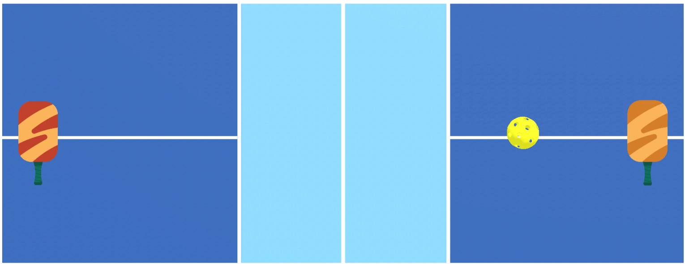

# dPickleBall Environment ([https://dpickleball.github.io/](https://dpickleball.github.io/))


# Installation Steps to Set Up dPickleball Environment:

1) conda create -n dpickleball pip python=3.10.12
2) conda activate dpickleball
3) git clone https://github.com/dPickleball/dpickleball-ml-agents.git
4) cd dpickleball-ml-agents
5) pip install -e ./ml-agents-envs
6) pip install -e ./ml-agents
7) pip install matplotlib
8) pip install opencv-python==4.7.0.72
9) pip install pynput==1.8.1
10) pip install numpy==1.23.5
11) Download this repo, modify the path in test_paral.py

# Usage:
Build URL: [https://drive.google.com/drive/u/0/folders/1lFqj6lopoIO96C_IO8yGXGzRMY1S4fzi](https://drive.google.com/drive/folders/1lFqj6lopoIO96C_IO8yGXGzRMY1S4fzi)
1) Download the build from the URL above 
2) conda activate dpickleball
3) python test_paral.py    **(remember to change path and point to the build)**
4) python test_paral_keyboard.py    **(for keyboard control, remember to change path and point to the build)**
5) The environment will be launched and shown. **(Ctrl + C to exit)**



# Rules:
1) Agents can move freely within their own half of the court. Paddles can rotate to control the ball’s rebound angle and direction, allowing for angled shots, spin, and advanced control.
2) The objective is to hit the ball to the opponent’s side of the court. One point is awarded if the opponent fails to return the ball. The first player to reach 21 points wins the match.
3) The winner of the previous point serves the next ball. At the beginning of the match, the right-side player serves first.
4) If the ball remains on one side of the court for more than 5 seconds without crossing over, the opposing player is awarded a point.
5) There are solid walls on the left and right sides of the court, and the ball will rebound off these walls during play.
6) A maximum response time of 0.01 seconds is expected from the agent; If no new action is received within the time window, the previous action will be reused for the current step.
7) Please make sure that your Python code could work on the default conda environment (dpickleball). If you need special Python packages, please refer to the next section on sharedmemory-based implementation. Your agent needs to be able to control paddles on both sides. You are allowed to use different checkpoints for left and right paddles.
8) Your agent takes real-time visual observation of the environment as input and outputs actions. The action space consists of three discrete components, each with three possible values: (0: none, 1: up, 2: down), (0: none, 1: right, 2: left), and (0: none, 1: counter-clockwise, 2: clockwise).
9) Your Python solution is expected to be the following form in your own Python .py file. Alternatively, please refer to the next section on shared-memory-based implementation.
```python
# Build a Python class for your solution, do preprocessing (image processing, frame stacking, etc) here.
# During competition, only the policy function is called at each time step, providing the observation and reward for that time step only.
# Your agent is expected to return actions to be executed.
class TeamX:
    def __init__(self):
        ...
    
    # Your policy takes only visual representation as input, 
    # and reward is 1 when you score, -1 when your opponent scores
    # Your policy function returns actions
    def policy(self, observation, reward):
        # Implement your solution here
        return action

```
During the competition, your policy function will be called before env.step()
```python

...
observation = env.reset()
reward_left = reward_right = 0
teamX = TeamX()
teamY = TeamY()
...

while ...:
    # Call policy before env.step()
    actions = {
        'agent_left_id': teamX.policy(observation, reward_left),
        'agent_right_id': teamY.policy(observation, reward_right)
    }

    # Then step the environment
    observation, rewards, dones, infos = env.step(actions)
    reward_left = rewards['agent_left_id']
    reward_right = rewards['agent_right_id']

```

# Competition Scripts


